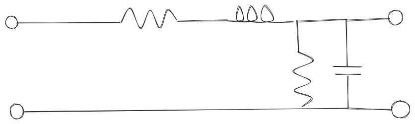

# Line de transmisión

# Equaciones telegrafista

$$
	\frac{\delta v(z,t)}{\delta x} = -R i(z,t)-L_d\frac{\delta i(z,t)}{\delta t}
$$

$$
	\frac{\delta i(z,t)}{\delta x} = -Gv(z,t)-C_d\frac{\delta v(z,t)}{\delta t}
$$

# RPS

La ecuación de onda para una línea de transmisión en regimen permanente senoidal es:

$$
  \frac{\delta V(z)}{\delta z} = -R I(z)-j\omega L_d I(z)=(R-j\omega L_d)I(z)
$$

$$
  \frac{\delta V(z)}{\delta z} = -ZI
$$

Donde Z es la impedancia característica $Z=R+j\omega L_d$

$$
  \frac{\delta V}{\delta z} = -G I-j\omega L_d I=YV
$$

Donde Y es la admitancia $Y=G+j\omega C_d$

$$
  \frac{\delta^2 V(z)}{\delta z^2} = -Z\frac{\delta I}{\delta z}=-ZYV=\gamma^2V
$$

Donde $\gamma$ es la constante de propagación $\gamma=\sqrt{ZY}$
Esta equación es la ecuación de onda para una línea de transmisión en regimen permanente senoidal.
Aplicando el operador $\frac{\delta}{\delta z}$ a la equación de intensidad se obtiene:

$$
  \frac{\delta ^2 I(z)}{\delta z^2} = -Y\frac{\delta V(z)}{\delta z}=YZI=\gamma^2I
$$

Desglosamos $\gamma$ en sus componentes real e imaginaria:

$$
  \gamma=\alpha+j\beta
$$

Donde $\alpha$ es la constante de atenuación y $\beta$ es la constante de fase.

Resolviendo la ecuación de onda para la tensión y la corriente se obtiene:

$$
  V(z)=V_0^+e^{-\gamma z}+V_0^-e^{\gamma z}
$$

$$
  I(z)=I_0^+e^{-\gamma z}+I_0^-e^{\gamma z}
$$

Donde $V_0^+$ y $V_0^-$ son las amplitudes de la onda incidente y reflejada respectivamente y $I_0^+$ y $I_0^-$ son las amplitudes de la onda incidente y reflejada respectivamente.
Para obtener una a partir de la otra se utiliza la relación de impedancias:

$$
  -\gamma V_0^+e^{-\gamma z}+\gamma V_0^-e^{\gamma z}=-Z(I_0^+e^{-\gamma z}+I_0^-e^{\gamma z})
$$

$$
  -\gamma V_0^+=-ZI_0^+\rightarrow I_0^+=\frac{-\gamma}{Z}V_0^+=\sqrt{\frac{Y}{Z}}V_0^+=\frac{V_0^+}{Z_0}
$$

$$
  \gamma V_0^-=ZI_0^- \rightarrow I_0^-=\frac{\gamma}{Z}V_0^-=\sqrt{\frac{Y}{Z}}V_0^-=-\frac{V_0^-}{Z_0}
$$

$$
  Z_0=\sqrt{\frac{Y}{Z}}=\sqrt{\frac{R+j\omega L_d}{G+j\omega C_d}}
$$

Donde $Z_0$ es la impedancia característica de la línea de transmisión.
